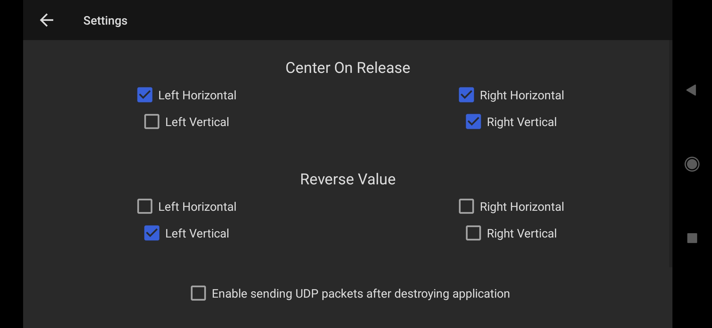

# PicoW_Copter

Affordable micro sub 100g coreless motor quadcopter made using Raspberry Pi pico W and controlled via an APP through WiFi.

First test flight (IT WORKS!!!) - https://www.youtube.com/shorts/tu2c7LCsRs8

Documentation link (Still working on this) - https://picow-copter-docs.readthedocs.io/en/latest/

APP to control PicoW Copter - [UDP Joystick](https://udpjoystick.en.aptoide.com/app) 
. delete Aptoid APP after installtion and just keep UDP Joystick APP 

Settings for the Android APP

PS - I will be back in July.
